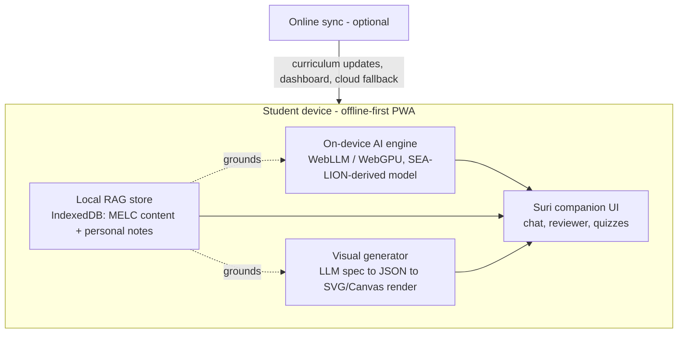

# Suri: Offline AI Study Companion for Filipino Learners

**ACM TechSprint × Accenture — Project Spec**

> "Matalinong kasama sa pag-aaral, kahit walang internet."
> A study buddy that's just as smart with zero signal as it is with full bars.

---

## 1. Problem statement

Many Filipino students face barriers to quality educational support due to limited access to tutors, connectivity constraints, and language differences. Existing learning platforms often fail to accommodate diverse learning needs — particularly for students who prefer learning in Filipino, study from printed modules instead of screens, or need guidance pitched to their actual grade level.

This isn't a hypothetical gap. As of 2023, only about 28% of Philippine households had fixed home internet, trailing Vietnam, Thailand, and Malaysia (Borgen Project, 2025, citing PSA/DICT data). More than 35% of public schools still have no internet connectivity at all, and roughly 20% lack functional computers (cited via Ragaza, 2025). The 2019 national ICT household survey — still the most-cited baseline — found about 80% of households without a computer and 84% without internet access, with BARMM and Bicol the hardest hit (DICT NICTHS 2019, via DepEd 2021). Separately, field studies in rural provinces consistently find that **almost all students already own a smartphone**, even when they have no laptop or PC access at home (Nueva Ecija digital-literacy study, 2025).

**Translation: the device gap is mostly closed. The connectivity gap is not.** Any solution that assumes "always-on internet" is solving the wrong half of the problem.

## 2. Solution overview

Suri is a Progressive Web App (PWA) with a fox mascot/study companion that runs its AI tutoring **entirely on the student's device**, with no internet connection required after the first setup download. It uses retrieval-augmented generation (RAG) grounded in DepEd's Most Essential Learning Competencies (MELCs) and the student's own uploaded materials, so answers stay curriculum-accurate instead of generic. Rather than picking from a fixed library of pre-built visuals (the way existing platforms like ExploreLearning's Gizmos do, with their 550+ hand-authored simulations), Suri generates a new visual — chart, labeled diagram, geometry figure — for the specific question a student is asking, every time.

When the device does have a connection, Suri quietly syncs in the background: pulling curriculum updates, sending progress to a parent/teacher dashboard, and falling back to a larger cloud model for anything genuinely beyond the on-device model's depth.

## 3. Target users & scope

- **Primary:** Grades 4–10 students using DepEd's K-12 curriculum, with emphasis on rural/low-connectivity areas and students who study primarily in Filipino or code-switch between Filipino and English.
- **Secondary:** Teachers and parents (via the optional sync dashboard) and senior high students reviewing for board-prep subjects.
- **Curriculum anchor:** DepEd Most Essential Learning Competencies (MELCs) — already the streamlined, de-duplicated version of the full K-12 curriculum (~5,700 competencies, reduced from ~14,000), making it a practical-sized corpus for an on-device RAG index.

## 4. Core features

### 4.1 Offline-first by design
- Full PWA install (works on Chrome/Edge for Android, the dominant browser/OS combination on budget devices).
- Service worker caches the app shell, curriculum corpus, and quantized model weights on first download (ideally over school/community Wi-Fi).
- 100% of core tutoring, quizzing, and reviewer features function with zero connectivity after that point.

### 4.2 On-device AI engine
- Runs a small quantized language model in-browser via WebGPU (WebLLM or equivalent runtime), with a WASM fallback for devices without WebGPU support.
- Base model: distilled/fine-tuned from **SEA-LION** (AI Singapore's open-source, Southeast-Asian-language model family, which explicitly covers Filipino) rather than a generic English-first small model — meaningfully better Filipino/Tagalog handling than bolting translation onto an English model.
- Practical target: 1–3B parameters quantized, sized for mid-range and budget Android devices, not just flagship phones.

### 4.3 Local RAG store ("customized reviewer")
- On-device vector index (IndexedDB) of MELC-aligned curriculum content by grade and subject.
- Students can add their own materials — typed notes, or photos of worksheets/textbook pages processed via on-device OCR — which get embedded into a personal layer of the same store.
- Every answer and generated quiz question is retrieved-and-grounded against this store before the model responds, reducing hallucination and keeping content aligned to the student's actual grade level and materials.

### 4.4 Generative visual questions
- Instead of selecting from a pre-built simulation library, the model outputs a structured spec (e.g., chart type + data, or diagram type + labeled parts) which a lightweight on-device renderer (SVG/Canvas) draws live.
- This keeps visual generation cheap enough to run offline on modest hardware, while staying reliable — the renderer can't draw something that doesn't parse, and the RAG layer fact-checks labels/values against curriculum content first.
- Covers: bar/line charts, number lines, geometric figures, labeled science diagrams (cell parts, body systems, simple circuits), and basic maps.

### 4.5 Study buddy mode
- Fox-voiced conversational tutor that defaults to Socratic guidance (asking a leading question back) rather than just outputting answers — both pedagogically stronger and pre-empts "this just does homework for you" concerns from educators/judges.
- Adjustable tone/difficulty by grade level, pulled from the student's profile.

## 5. Stretch features (phase 2, post-hackathon roadmap)

| Feature | Why it matters |
|---|---|
| Code-switching support (Filipino/English/regional languages) | Matches how students actually speak; bigger reach than a single-language toggle |
| Classroom mesh sync (WebRTC/Bluetooth, device-to-device) | One connected phone can pass a curriculum pack to a whole classroom without everyone needing signal |
| Spaced-repetition scheduling for reviewer content | Turns the reviewer into a long-term retention tool, not just cram-night help |
| On-device text-to-speech / speech-to-text | Supports lower-literacy users and auditory learners |
| Dyslexia-friendly font + color-blind-safe palette toggle | Low-cost, high-value accessibility |
| "Lite mode" for older/budget devices | Smaller model, fewer animations — keeps the offline-access promise honest at the low end |
| Parent/teacher dashboard (sync-when-online) | Progress visibility without requiring the student to always be online |

## 6. Mascot & brand identity

**Recommended name: Suri** — short for *suriin* ("to examine/analyze"), and already a natural-sounding Filipino nickname, so it reads as a companion rather than a tech-brand name.

- **Alternate directions:** *Tusi* (from *tuso*, "cunning/sly" — leans into the universal fox-as-clever-trickster archetype) or *Kislap* ("spark" — leans into energetic/playful).
- **Important naming note:** Avoid naming the mascot or app "Gizmo" — that's the existing product name of ExploreLearning's Gizmos platform in this exact category, and the overlap will read as a miss to anyone who knows the space.

**Personality:** Quick-witted, encouraging, never condescending. Asks guiding questions before giving answers. Energetic default pose (ears up, mid-bounce) rather than static/sitting.

**Visual design:**
- Chibi proportions (large head/eyes, small body) — reads as approachable *and* keeps the vector asset small, which matters directly for the offline/low-bandwidth value proposition.
- One or two Philippine-specific accents instead of generic fox coloring — e.g. a small sun-ray tuft on the chest echoing the flag, or a woven *salakot*-style accessory instead of a generic mortarboard.
- Color palette: warm orange/cream base with a single accent color reserved for "active/AI thinking" states (e.g. a soft glow on the tail tip when generating an answer) — keeps it warm and organic rather than reading as a cold robot mascot.

**Engagement mechanic:** Tie visual evolution to study streaks (kit → fox → "elder fox" with subtle glowing markings) so consistent use has a visible payoff, in the spirit of (but visually distinct from) Duolingo's streak mechanic.

## 7. Technical architecture

**Suggested stack:**

| Layer | Technology | Notes |
|---|---|---|
| App shell | PWA (manifest + service worker) | Installable, works on low-end Android, no app-store dependency |
| On-device inference | WebLLM (WebGPU) with WASM fallback | ~80% native speed when WebGPU available; broad fallback otherwise |
| Base model | SEA-LION-derived, distilled/quantized to 1–3B params | Open-source (MIT), already trained on Filipino + other SEA languages |
| Local vector store | IndexedDB + lightweight embedding model (e.g. via Transformers.js) | Holds MELC corpus + student-uploaded content |
| Visual rendering | SVG/Canvas templates driven by structured LLM output | Avoids heavy offline image-generation models entirely |
| OCR (notes/photos) | On-device OCR (e.g. WASM-compiled Tesseract or similar) | Powers the "photo of your worksheet" reviewer input |
| Sync (when online) | Background sync via service worker | Curriculum updates, dashboard push, optional cloud-model fallback |

## 8. Why this is differentiated

| | Typical "AI study app" | Suri |
|---|---|---|
| Offline mode | Caches pre-made content for later viewing | Runs the AI model itself, fully offline |
| Visuals | Either none, or a fixed library to pick from | Generated fresh per question, grounded in curriculum |
| Language | English-first, Filipino bolted on via translation | Built on a model continually trained on Filipino + SEA languages |
| Personalization | Generic question banks | RAG over the student's own notes/materials |
| Data | Often routed through a cloud API | Inference happens on-device by default — privacy by architecture, not just policy |

## 9. Risks & honest mitigations

- **Small on-device models are less capable than GPT-4-class cloud models.** Mitigate by leaning on RAG grounding (retrieval does a lot of the accuracy work that raw model size would otherwise need to do) and by offering a cloud fallback for the hardest questions when online.
- **Model download size could itself be a barrier on very limited storage/data plans.** Mitigate with a "lite" model tier, and design the first download to be completable over school Wi-Fi rather than mobile data.
- **WebGPU support varies by device.** Mitigate with a WASM fallback path (slower, but functional) for older hardware.
- **Visual generation could still produce incorrect diagrams if not grounded properly.** Mitigate by always running the visual spec through the RAG layer before rendering, and keeping the renderer's vocabulary deliberately limited (a fixed set of diagram *types* with AI-filled *parameters*, not fully open-ended drawing).

## 10. MVP scope for the hackathon

Realistic for a hackathon timeframe:
1. PWA shell with offline install + service worker caching.
2. Small quantized model running via WebLLM for one subject and 1–2 grade levels (proves the offline-inference concept without needing the full curriculum corpus).
3. A working RAG demo: upload a sample reviewer/notes file, ask a question, show the grounded answer.
4. 2–3 working visual question types (e.g., bar chart + one labeled diagram) to prove the "generative, not curated" claim live.
5. Suri mascot integrated into the chat UI, with at least the base design (evolution mechanic can be described in the pitch deck even if not fully built).

Everything in Section 5 (stretch features) is roadmap material for the pitch deck's "what's next" slide, not required for the demo.

## 11. One-line pitch

*"Suri is the first study buddy that's just as smart with zero signal as it is with full bars — an AI tutor that runs entirely on a student's own phone, thinks in Filipino, and draws a new diagram for every question instead of picking one off a shelf."*

---

*Sources referenced: Borgen Project (2025) on Philippine digital inclusion; Malque Publishing rural-education study citing Ragaza (2025) and DICT NICTHS (2019) via DepEd (2021); Nueva Ecija rural digital-literacy study (2025); ExploreLearning/Gizmos product documentation; AI Singapore's SEA-LION model documentation; MLC-AI WebLLM documentation; DepEd MELC guidance materials.*
