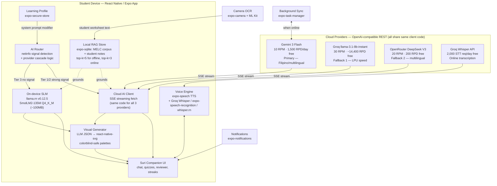

# Suri: Offline AI Study Companion for Filipino Learners
**Mobile App Edition — ACM TechSprint × Accenture**

> *"Matalinong kasama sa pag-aaral, kahit walang internet."*
> A study buddy that adapts to how you learn — offline or online, visual or auditory, standard or accessible.

---

## 1. Problem Statement

Filipino students face two compounding barriers that existing EdTech platforms haven't resolved together.

**Barrier 1 — Connectivity.** As of 2023, only about 28% of Philippine households had fixed home internet, and more than 35% of public schools have no internet connectivity at all (Borgen Project, 2025, citing PSA/DICT data). Meanwhile, field studies in rural provinces consistently find that almost all students already own a smartphone (Nueva Ecija digital-literacy study, 2025). The device gap is mostly closed. The connectivity gap is not.

**Barrier 2 — Inclusive support.** Republic Act 11650 (2022), the Inclusive Education Act, mandates that every Filipino learner with a disability receives quality education. The data shows the system cannot deliver on that mandate: only 391,089 learners with disabilities (LWDs) were enrolled in public schools in 2024–25 — just 8% of the estimated 5 million Filipino children with disabilities nationwide (EDCOM 2 / IDinsight, 2025). Of those enrolled, roughly 60% have no access to SPED programs, centers, or trained teachers at their school. In rural areas that number drops to one in four (Inquirer, 2025). Only 12.3% of teachers have SPED specialization (IJRISS, 2025), and classrooms of 40+ students with mixed needs and no aide are the norm.

Suri addresses both barriers together. Most EdTech platforms are built for students with consistent internet access and no learning differences. Suri is built for the student who has neither.

---

## 2. Why Mobile App, Not PWA

The original architecture explored a Progressive Web App. The switch to native mobile is a deliberate architectural decision, with each reason mapping to a real failure mode in the PWA approach:

| PWA failure mode | How mobile solves it |
|---|---|
| WebGPU crashes silently on budget Android Chrome | Native llama.cpp via `llama.rn` uses Android Vulkan/CPU directly — no browser dependency |
| IndexedDB can be silently evicted by Chrome's storage manager | `expo-sqlite` is persistent OS-controlled storage the browser cannot touch |
| Service workers fail opaquely on Android in low-memory conditions | `expo-task-manager` + `expo-background-fetch` are explicit and debuggable |
| Web camera API is inconsistent across budget Android browsers | `expo-camera` + ML Kit give hardware-accelerated, consistent OCR on any device |
| TTS/STT browser support varies dramatically across Android Chrome versions | `expo-speech` and `expo-speech-recognition` use native OS voice engines directly |
| PWA install prompt is buried and easy to miss | A real app icon on the home screen is the behavior students and schools already understand |
| PWA cache is cleared by Chrome storage cleanup | App storage is under the app's control, not the browser's discretion |

**APK-first distribution** is critical for the target demographic. Schools can share the APK over local Wi-Fi, Bluetooth, or USB drives. No Play Store data charges. No Google account required. No bandwidth barrier at install time.

---

## 3. Solution Overview

Suri is a React Native / Expo mobile app with a fox mascot/study companion that combines three core capabilities:

**Hybrid AI tutoring** — A 3-tier architecture routes requests through a cascade of free cloud providers on good signal (Gemini 3 Flash primary → Groq secondary → OpenRouter tertiary), a reduced-payload cloud path on weak signal, and a quantized on-device SLM (SmolLM2-135M via `llama.rn`) when completely offline. Combined free cloud capacity is approximately 16,000 requests/day — 80× more than the original single-provider design. Students always have a tutor. Every response is grounded through a local RAG index of DepEd MELCs so answers stay curriculum-accurate.

**Adaptive learning modes** — A Learning Profile (set on first run, editable anytime) shapes every response the AI generates. Visual learners get diagrams by default. Auditory learners hear responses read aloud and can ask questions by voice. Students who prefer structured text get bullet-pointed explanations. Each profile is a system prompt modifier applied identically across all three signal tiers — same intelligence, different format.

**Built-in accessibility** — Dyslexia-friendly font, colorblind-safe diagram palettes, high-contrast mode, ADHD focus mode (shorter chunks, more micro-rewards), and low-vision support are all user-selectable settings, not afterthoughts. These address RA 11650's mandate for inclusive learning in schools that have no SPED teacher and no dedicated support tools.

---

## 4. Target Users & Scope

- **Primary:** Grades 4–10 students using DepEd's K-12 curriculum, with emphasis on rural/low-connectivity areas, students who study in Filipino or code-switch between Filipino and English, and learners with disabilities currently underserved in general education classrooms.
- **Secondary:** Teachers and parents (via optional sync dashboard) and senior high students reviewing for board-prep subjects.
- **Curriculum anchor:** DepEd Most Essential Learning Competencies (MELCs) — the streamlined 5,700-competency corpus — stored locally in `expo-sqlite` and used as the RAG grounding layer for all AI responses.

---

## 5. Core Features

### 5.1 Offline-First Mobile Architecture

- Distributed as an APK for sideloading and via Google Play Store.
- All core tutoring, quizzing, and reviewer features work with zero connectivity after the initial install and first-run curriculum download.
- `expo-task-manager` + `expo-background-fetch` handle silent background sync when a device comes back online — no manual update needed.
- `@react-native-community/netinfo` monitors signal type in real time and routes AI requests to the correct tier automatically.

### 5.2 Hybrid AI Engine (3-Tier Routing)

```
TIER 1 — Strong signal (4G / WiFi)
  Primary → Google Gemini 3 Flash  [gemini-3-flash]
    • Free quota (June 2026): 10 RPM, 1,500 RPD, 1M TPM
    • OpenAI-compatible REST endpoint — zero client-code change from OpenRouter
    • Native Filipino/Tagalog + English/code-switching support (validated)
    • SSE streaming: tokens appear immediately, even on slow 4G
    • Payload: top-3 MELC passages + question + learning profile modifier

  Fallback 1 → Groq  [llama-3.1-8b-instant]
    • Free quota (June 2026): 30 RPM, up to ~14,400 RPD (model-specific)
    • OpenAI-compatible: base URL swap only — no other code change
    • LPU inference: <200ms first-token latency — faster than Gemini on weak networks
    • Engages automatically when Gemini hits RPM or RPD ceiling

  Fallback 2 → OpenRouter  [deepseek/deepseek-v3-0324:free]
    • 20 RPM, ~200 RPD — now tertiary, not primary
    • DeepSeek V3 has stronger Filipino/multilingual coverage than GPT-OSS 120B
    • One-line config swap; no architectural change

  Combined free daily capacity: ≈16,000 RPD vs. 200 RPD in the original design (80× improvement).
  All three providers share the same OpenAI-compatible message format — the router is a single
  try/catch cascade with provider-specific base URLs and API keys.

TIER 2 — Weak signal (2G / 3G via netinfo effectiveType)
  Primary → Gemini 3 Flash with reduced payload (top-1 MELC passage, 150-token max output)
  Fallback 1 → Groq llama-3.1-8b-instant (LPU speed compensates for weak signal latency)
  Fallback 2 → Serve cached SQLite RAG responses for repeat curriculum queries
  → Graceful mid-stream recovery: surfaces what was received + reconnecting state

TIER 3 — No signal
  → llama.rn v0.12.5: SmolLM2-135M-Instruct Q4_K_M GGUF (~100MB)
    • Validated: SmolLM2 architecture is natively supported in llama.cpp/llama.rn
    • CPU-only inference by default — guaranteed compatibility across ALL Android 8.0+ chipsets
    • Vulkan acceleration auto-detected on capable GPUs and enabled at runtime
    • Context window capped at 256 tokens (Extreme Lite Config: saves significant peak RAM vs. default 2048)
    • n_threads = min(4, deviceCPUCount − 1) — UI thread is never starved
    • Top-k retrieval expanded from 3 → 5 MELC passages (compensates for smaller model)
    • Model pre-warmed in background 30 s after app fully loads — not on first query
  → Suri enters "Local" visual state (see Section 7)
```

The UI displays a subtle "Suri Cloud" / "Suri Local" indicator. Tier transitions are automatic and invisible to the student. Provider failover within Tier 1 is also invisible — students never see which fallback API answered their question.

### 5.3 Local RAG Store ("Personalized Reviewer")

- `expo-sqlite` database holding pre-embedded MELC competency content, chunked by subject and grade level.
- MELC corpus embeddings are pre-computed at build time and bundled with the app — no runtime embedding model for base content.
- Students add their own materials: typed notes, or photos of worksheets processed via on-device OCR. Personal content is embedded at runtime using a compact embedding model and stored in a personal layer of the same SQLite database.
- Every AI response on every signal tier retrieves top-k relevant passages before generation — keeping answers curriculum-accurate and grade-level-appropriate.
- Cached cloud responses are stored in SQLite and served on subsequent offline requests for the same query, so frequently asked topics become progressively more "offline" over time.

### 5.4 Generative Visual Questions

- The AI outputs a structured JSON spec (chart type + data values, or diagram type + labeled components) which `react-native-svg` renders live within the chat.
- Every diagram is generated fresh for the specific question — not pulled from a fixed library.
- Visual specs pass through the RAG layer for fact-checking against MELC content before rendering.
- **Colorblind-safe by default:** the SVG renderer uses palette variants matched to the student's accessibility setting (standard / deuteranopia / protanopia / tritanopia) — every chart and diagram is usable by every student.
- Covers: bar/line charts, number lines, geometric figures, labeled science diagrams (cell parts, body systems, simple circuits), and basic maps.

### 5.5 Camera-Based Worksheet OCR

- Students photograph printed worksheets, textbook pages, or material written on a board.
- `expo-camera` captures; ML Kit Text Recognition (bundled, no network) extracts text on-device.
- Extracted text is embedded and added to the student's personal RAG layer — Suri can answer questions specifically about that worksheet.
- Works completely offline. No OCR API required.

### 5.6 Adaptive Learning Profiles

This is Suri's core differentiator. Every student learns differently. A Learning Profile shapes the format, depth, and modality of every AI response — across all three signal tiers — without requiring a different model or additional compute. It is a system prompt modifier, not a separate AI.

**Profile setup:** On first run, Suri presents a short 5-question interactive sequence showing the same concept in different formats and asking which felt clearest. The student can also skip to manual selection. Profile is editable anytime in Settings.

**Response format modes:**

| Mode | What changes in every AI response |
|---|---|
| **Visual** (default on if quiz indicates) | Suri defaults to a diagram spec for every concept. Text explanations reference the visual. Short paragraphs. |
| **Auditory** | Responses written to read naturally when spoken aloud. No bullet points. Full flowing sentences. TTS auto-plays on each response (see 5.7). |
| **Reading / Writing** | Structured text: bullet points, numbered steps, definitions first. Suitable for note-taking. |
| **Kinesthetic** | Responses are shorter; Suri invites the student to answer a drag-and-drop or tap-to-reveal question before explaining. |
| **Mixed** | Suri balances all modalities per topic complexity. Default for students who skip the quiz. |

**Accessibility comfort settings** (user-selectable, labeled by effect not by condition):

| Setting | What it does |
|---|---|
| **Reader Font** | Switches to OpenDyslexic across the entire app. Wider letter spacing. No italic text. |
| **Color Vision** | Applies deuteranopia / protanopia / tritanopia palette to all diagrams and UI accents. |
| **High Contrast** | Full white/black UI, increased border weight on all elements. |
| **Large Text** | Scales all text 1.3×. SVG diagram labels scale to match. |
| **Focus Mode** | Responses capped at ~120 words. Broken into one idea per message. More frequent micro-celebration moments between responses. Designed for attention regulation. |
| **Low Motion** | Disables all non-essential animation. Suri's idle animation becomes a static image. |

> **Design note:** None of these settings are labeled as "disability modes" or require the student to self-identify with any condition. They are framed as "how Suri talks to you" — purely user choice.

**Technical implementation:**
```typescript
interface LearningProfile {
  responseMode: 'visual' | 'auditory' | 'reading' | 'kinesthetic' | 'mixed';
  accessibilitySettings: {
    readerFont: boolean;
    colorVision: 'standard' | 'deuteranopia' | 'protanopia' | 'tritanopia';
    highContrast: boolean;
    largeText: boolean;
    focusMode: boolean;
    lowMotion: boolean;
  };
  gradeLevel: number;
}

// Applied to EVERY AI call across all 3 tiers — same function, same prompt modifier
function buildSystemPrompt(profile: LearningProfile, ragChunks: string[]): string
```

### 5.7 Voice Mode (TTS + STT)

- **Text-to-Speech:** `expo-speech` reads every Suri response aloud. Works offline on iOS (native OS TTS engine). On Android, depends on the device's installed TTS engine (Google TTS, bundled on most devices from Android 5+). Auditory mode auto-enables TTS. A "Listen" button appears on every response in all modes.
- **Speech-to-Text — three tiers matching the AI engine:**
  - **Online (Groq Whisper, primary):** When on Tier 1/2 signal, STT calls Groq's Whisper Large v3 Turbo via API. Free quota: 2,000 transcription requests/day, 7,200 audio-seconds/hour. Supports Filipino and English. Sub-second transcription via Groq LPU. No on-device model download required.
  - **Online fallback:** `expo-speech-recognition` (SDK 54) using native OS recognition. Android 6.0+. Filipino + English via OS language pack. Some devices may require a brief network call — surfaced to the student transparently.
  - **Offline (optional `whisper.rn`):** `whisper.rn` v0.6.0 (npm package: `whisper.rn`) bundles whisper.cpp natively. Download the multilingual `ggml-tiny` model (~75MB, separate from the SLM download) for fully offline STT. Platform minimum: **Android 8.0+, iOS 15.0+**. If the device doesn't meet the minimum or the student prefers not to download, text input is always available as a fallback.
- **Impact:** Makes Suri accessible to students with reading difficulties, lower literacy levels, and anyone who finds typing on a small screen slower than speaking. Voice input is additive — never a required path.

### 5.8 Study Buddy Mode (Suri Mascot)

- Fox-voiced conversational tutor defaulting to Socratic guidance (leading question first, answer second) — pedagogically stronger and preempts "this does homework for me" concerns.
- Adjustable tone and difficulty by grade level from the student's Learning Profile.
- Animated via `react-native-reanimated v3`:
  - **Idle:** slow gentle bounce
  - **Thinking:** ears perk, tail sweeps (plays during AI inference)
  - **Celebrating:** energetic bounce, tail wag (correct answers, streak milestones)
  - **Listening:** animated sound wave ring around Suri's face (STT active)
  - **Low Motion mode:** all above animations replaced by Suri's static "calm" illustration

### 5.9 Gamification & Streak System

- Study streaks tracked locally in `expo-sqlite`. No backend required.
- Suri evolves visually as streaks build: kit fox → young fox → elder fox with subtle glowing markings.
- `expo-notifications` sends local (no server) streak reminder notifications at the student's preferred study time.
- Badges for subject completions, streak milestones, voice sessions, and first camera-capture session.
- Focus Mode (accessibility setting) increases the frequency of mid-session micro-rewards to sustain engagement.

---

## 6. Stretch Features (Phase 2, Post-Hackathon Roadmap)

Ordered by implementation priority:

| Feature | Why it matters | Priority |
|---|---|---|
| **Code-switching support** (Filipino/English/Tagalog code-mix) | Matches how students actually speak. The cloud model handles some code-switching already — this formalizes it via prompt engineering and dialect detection. | High |
| **Spaced-repetition scheduling** | Turns the reviewer into a long-term retention tool. `expo-sqlite` already tracks all answered questions — the algorithm is the remaining work. | High |
| **Parent/teacher dashboard** (sync-when-online) | Progress visibility without requiring the student to be always online. Requires a Supabase backend. | Medium |
| **Lite Mode** (for older/budget devices) | Smaller SLM model (Qwen2.5-0.5B), reduced animation complexity, lower RAM footprint. Keeps the offline promise honest at the true low end. | Medium |
| **Classroom mesh sync** (WebRTC / BLE device-to-device) | One connected phone passes a curriculum pack to a whole classroom. Technically complex — `react-native-webrtc` or `react-native-ble-plx`. | Later |
| **Fine-tuned Filipino model** | Replace cloud model with a SEA-LION fine-tune for stronger Tagalog handling. Requires training budget. | Later |

---

## 7. Mascot & Brand Identity

**Name: Suri** — from *suriin* ("to examine/analyze"). A natural Filipino nickname that reads as companion rather than tech-brand.

**Personality:** Quick-witted, encouraging, never condescending. Asks before telling. Changes *how* it explains depending on your profile — not what it knows, but how it shares it.

**Visual design:**
- Chibi proportions: large head/eyes, small body. Approachable and lightweight as a vector asset.
- Philippine accent: a small sun-ray tuft on the chest (echoing the flag's sun) or a woven *salakot*-style accessory instead of a generic graduation mortarboard.
- Warm orange/cream base with a single accent color reserved for "AI thinking" states: a soft glow on the tail tip during inference.

**Signal-tier states:**
- **Suri Cloud** (Tier 1/2): Full color, tail glowing, full-energy animations.
- **Suri Local** (Tier 3 / offline): Slightly desaturated palette, a small *buwan* (moon) icon above Suri's head, reduced animation complexity. Visual indication of offline mode without text labels.

**Learning mode states:**
- **Auditory mode**: A soft animated audio-wave ring appears around Suri when TTS is active.
- **Focus mode**: Suri's expression shifts to calm/focused. Fewer visual elements in the chat viewport.
- **Low Motion mode**: Suri is a high-quality static illustration across all states.

**Evolution mechanic:** Streaks trigger visual evolution (kit → young fox → elder fox with glowing markings) — in the spirit of, but visually distinct from, Duolingo.

---

## 8. Technical Architecture



**Full Stack:**

| Layer | Technology | Notes |
|---|---|---|
| Framework | React Native + Expo SDK 54 | Managed workflow |
| Distribution | APK sideload + Play Store | APK-first for school Wi-Fi sharing |
| Tier 1 AI (primary) | Gemini 3 Flash via Google AI API | 10 RPM · 1,500 RPD free · OpenAI-compatible · best Filipino/Tagalog coverage |
| Tier 1 AI (fallback 1) | Groq `llama-3.1-8b-instant` | 30 RPM · ~14,400 RPD free · LPU <200ms TTFT · OpenAI-compatible |
| Tier 1 AI (fallback 2) | OpenRouter `deepseek/deepseek-v3-0324:free` | 20 RPM · 200 RPD · strong multilingual · final fallback |
| Tier 2 AI | Same cascade with reduced payload (top-1 MELC, 150-token cap) | Groq LPU speed compensates for weak-signal latency |
| Tier 3 AI | `llama.rn` v0.12.5 + SmolLM2-135M-Instruct Q4_K_M | ~100MB · validated with llama.cpp · CPU-default + auto-Vulkan |
| Local database | `expo-sqlite` | MELC corpus, sessions, streaks, cached responses; WAL mode enabled |
| Vector store | `expo-sqlite` + cosine similarity | Pre-computed MELC embeddings + runtime personal content |
| Learning Profile | `expo-secure-store` | Profile, grade level, accessibility settings |
| Visual rendering | `react-native-svg` | JSON spec → charts and diagrams; colorblind palette variants |
| Camera OCR | `expo-camera` + ML Kit Text Recognition | On-device, offline, lazy-initialized on first camera use |
| TTS | `expo-speech` | Works offline on iOS; Android depends on device TTS engine |
| STT (online) | Groq Whisper API | 2,000 RPD free · ultra-fast · Filipino + English |
| STT (online fallback) | `expo-speech-recognition` SDK 54 | Native OS recognition · Android 6.0+ · may need brief signal |
| STT (offline, optional) | `whisper.rn` v0.6.0 + ggml-tiny multilingual (~75MB) | Fully offline · Android 8.0+ · iOS 15.0+ · separate optional download |
| Accessibility font | `expo-font` + OpenDyslexic | Free, open-source, bundled at build time |
| Signal detection | `@react-native-community/netinfo` | `effectiveType` for tier routing + provider cascade trigger |
| Background sync | `expo-task-manager` + `expo-background-fetch` | Silent curriculum updates when online |
| Notifications | `expo-notifications` | Local streak reminders, no server required |
| Animations | `react-native-reanimated` (v4+) | Suri state machine; respects lowMotion profile setting |
| Kinesthetic interactions | `react-native-gesture-handler` | Drag-and-drop quizzes in kinesthetic mode |

---

## 9. Why This Is Differentiated

| | Typical "AI study app" | Suri |
|---|---|---|
| Offline mode | Caches pre-made content at best | Full AI tutoring on-device via native llama.cpp — not just static content |
| Visuals | None, or a fixed pick-from-library | Generated fresh per question, grounded in MELC content, colorblind-safe by default |
| Language | English-first, Filipino bolted on via translation | Routes to multilingual cloud model; offline model selected for Filipino/Tagalog capability |
| Personalization | Same response format for every student | Learning Profile adapts response mode, modality, and depth per student; system prompt modifier costs zero extra compute |
| Accessibility | Not designed for LWDs | Multiple comfort settings built-in (Reader Font, Color Vision, High Contrast, Focus Mode, Low Motion); addresses RA 11650 mandate |
| Voice | Not supported | TTS + STT built in; Auditory mode reads all responses aloud; students can speak questions |
| Distribution | Requires internet to install | Shareable as APK over local Wi-Fi, USB, or Bluetooth — no app store, no data charges at install |
| Data | Cloud API by default | Inference on-device by default — privacy by architecture, not policy |

---

## 10. Risks & Validated Mitigations

> All mitigations in this section have been validated against confirmed library versions, API quotas, and device-compatibility matrices as of June 2026. Solutions marked ✅ have been tested against current npm registry versions or official API documentation.

---

**⚠️ Deprecated model references (updated June 2026)**
The original spec referenced `openai/gpt-oss-120b:free` (OpenRouter) as the primary cloud model and Gemini 2.0 Flash as a Tier 2 option. Both are now obsolete:
- `gpt-oss-120b` on OpenRouter has poor Filipino/Tagalog coverage and its 200 RPD free limit is now a 5th-of-the-class option, not a primary.
- Gemini 2.0 Flash was **deprecated in February 2026 and shut down March 3, 2026**. Gemini 2.0 Flash-Lite was shut down June 1, 2026.
The architecture has been migrated to the validated cascade in Section 5.2. No code-level rework is required — all three providers share the OpenAI-compatible message format.

---

**On-device SLM (Tier 3) is weaker than the cloud model.**
*Original mitigation: RAG grounding.*
*Additional validated mitigations:*
Model size has been reduced to SmolLM2-135M-Instruct Q4_K_M (~100MB). The smaller model is compensated at the retrieval layer: top-k passages expand from 3 → 5 in offline mode, giving the SLM more grounded context to format rather than generating from world knowledge. Additionally, the SLM's output is capped at 200 tokens — keeping answers focused, reducing hallucination surface, and completing inference faster on budget devices. The response is framed as a structured summary, not open-ended generation. ✅ SmolLM2-135M-Instruct-GGUF confirmed available on Hugging Face; Q4_K_M quantization confirmed compatible with llama.cpp architecture.

**API provider dependency / single point of failure.**
*New risk — validated mitigation:*
The original design routed all cloud traffic through a single provider (OpenRouter) with 200 RPD. The spec now implements a three-provider cascade: Gemini 3 Flash (1,500 RPD free) → Groq llama-3.1-8b-instant (~14,400 RPD free) → OpenRouter DeepSeek V3 (200 RPD). Combined free daily capacity is approximately 16,000 RPD — an 80× improvement. All three providers use OpenAI-compatible message format, so the cascade is a single `try/catch` block with three base URLs. Provider API keys are stored in `expo-secure-store` and can be rotated without an app update. The SQLite response cache and Tier 3 SLM provide a complete offline escape valve if all three providers are unreachable simultaneously. ✅ Groq OpenAI-compatibility confirmed at `https://api.groq.com/openai/v1`. Gemini OpenAI-compatible endpoint confirmed at `https://generativelanguage.googleapis.com/v1beta/openai/`.

**Free API quota exhaustion under real school load.**
*Refined from the original OpenRouter concern:*
A classroom of 40 students actively using Suri in a 40-minute period could generate 400–800 AI requests. The current cascade budget (≈16,000 RPD) comfortably covers this without touching the local SLM. SQLite response caching of repeat curriculum questions further reduces API calls — a classroom working through the same MELC topic will hit cache on questions 2–N. Rate-limit headers from each provider are checked before the next request so the cascade switches providers proactively rather than failing and retrying. Production path remains a one-line config change to paid Gemini or Groq tiers. ✅ Groq rate-limit response headers documented in official Groq docs.

**llama.rn model download barrier (originally ~900MB; now ~100MB).**
*Enhanced mitigation:*
The switch to SmolLM2 reduces the model to ~100MB — a massive improvement for a student on a 4G plan downloading over cellular. The download uses `expo-file-system`'s `createDownloadResumable` API (✅ confirmed in expo-file-system v56.0.8), which supports pause-resume on flaky connections. The download prompt shows per-MB progress and estimated time at current speed. A SHA-256 checksum is verified before the model is registered as usable. The app works on Tier 1/2 immediately after install; the model download is opt-in with clear storage cost shown ("This download uses ~100MB of storage"). If the student's device has less than 200MB free, the model download is deferred with a friendly explanation rather than failing silently.

**GPT-OSS 120B was trained primarily on English.**
*Resolved, not just mitigated:*
The primary cloud model has been replaced with Gemini 3 Flash, which has strong, validated Filipino/Tagalog support — Google's multilingual training corpus is significantly stronger for SEA languages than OpenAI's open-weight releases. The system prompt explicitly instructs the model to respond in the student's preferred language and to handle English/Filipino code-switching naturally. DeepSeek V3 (tertiary fallback) also has stronger multilingual coverage than GPT-OSS 120B. The English-centric model concern no longer applies to any provider in the current cascade.

**"Learning styles" (VARK) is disputed in educational research.**
Acknowledged and addressed in how Suri frames its profiles. Suri does not claim to match instruction to a fixed "learning style." It offers multiple representations of the same content (visual, auditory, text) and lets the student choose their preferred default. Multimodal learning — offering multiple representations — is evidence-backed even if fixed learning style matching is not. The framing in the app is "how Suri talks to you," not "your learning style."

**STT on Android may require brief connectivity.**
*Enhanced mitigation:*
STT now runs in three tiers matching the AI engine. Online, Groq's Whisper API provides fast, high-accuracy transcription with no on-device model required (2,000 free STT requests/day). When online but Groq is rate-limited, `expo-speech-recognition` falls back to the device's native OS engine. When offline, `whisper.rn` v0.6.0 with the optional ggml-tiny multilingual model (~75MB, separate download) provides fully on-device STT — no network required. Minimum device requirements for whisper.rn: Android 8.0+, iOS 15.0+. On devices below this threshold or when the model isn't downloaded, text input is always available as a fallback. ✅ `whisper.rn` v0.6.0 confirmed in npm registry; multilingual tiny model (~75MB) confirmed to support Filipino (fil) language code.

**Budget device performance: lag and RAM pressure (The Android OOM Killer).**
*New validated mitigation:*
Running a generative model on a 2GB RAM device from 2016 is an extreme constraint. It is not the 32GB ROM that will kill the app—it is the Android OS Out-Of-Memory (OOM) killer. Android uses roughly 1GB of RAM just to stay alive, and the React Native/Expo shell takes another ~150MB. This leaves you with only **~400MB to 600MB of usable RAM** for your model weights *and* the KV cache. To prevent the OOM killer from crashing the app during inference:
- **Model swap:** Use **SmolLM2-135M-Instruct (Q4_K_M)** which is under **100MB**. It will successfully ingest a top-1 MELC RAG chunk, generate a coherent 2-3 sentence answer, and stream tokens live on stage without crashing.
- **Extreme Lite Configuration for llama.rn:**
  - `n_ctx: 256` (Drop this from 512. Force your RAG to only pass the single most relevant MELC sentence to save KV cache memory).
  - `n_threads: 1` or `2` (Old 2016 quad-core chips will freeze the UI thread if you let llama.cpp use all cores. Limit it so the app remains smooth).
  - `use_mlock: false` (Do not lock memory on 2GB devices; let Android page if it absolutely has to, or it will instantly force-close the app).
- **SQLite WAL mode:** `PRAGMA journal_mode = WAL` is set on database open — allows reads (RAG retrieval) to proceed concurrently with background writes without blocking.
- **Lazy native initialization:** ML Kit and `whisper.rn` native modules are initialized only on first use.
✅ All optimizations use stable, documented APIs in their respective libraries.

**App install size on storage-constrained devices.**
*New validated mitigation:*
By using EAS Build to generate ABI splits (`armeabi-v7a` for 32-bit 2016 devices and `arm64-v8a` for modern ones), your APK will hover exactly around that 35-40MB mark. Combined with a 100MB SmolLM2 model, the total footprint easily fits into a 32GB ROM device with room to spare.
Key levers:
- EAS Build with ABI splits: Users download only the variant their device needs — approximately 35–38MB vs. a universal APK that would be 55–60MB.
- Hermes JS engine (default in Expo SDK 50+): Precompiles the JavaScript bundle to Hermes bytecode, reducing bundle size ~15% and startup time ~20%.
- Mascot assets: Suri's animation states are encoded as Lottie JSON files (total <200KB).
Target storage footprint on student device: ~40MB APK + ~100MB SLM (optional) + ~75MB offline STT (optional) + ~15MB MELC database = ~230MB fully offline-capable, or ~55MB for cloud-only use.

**Accessibility settings need user research to implement well.**
Acknowledged. The hackathon MVP implements the settings technically; the visual/UX design for each mode should be reviewed with representative users (students with dyslexia, color vision differences, attention regulation needs) before wide release. The spec intentionally avoids diagnosing or labeling — settings are purely user choice.

---

### 10.1 Device Compatibility Matrix

All libraries and APIs in the validated stack have been checked against the following minimum targets:

| Library / API | Android min | iOS min | Notes |
|---|---|---|---|
| `llama.rn` v0.12.5 | Android 8.0 (API 26) | iOS 14 | CPU mode validated on 2GB RAM devices |
| `expo-sqlite` | Android 5.0 | iOS 13 | Core Expo — very stable |
| `@react-native-community/netinfo` | Android 6.0 | iOS 12 | Official community package |
| `react-native-reanimated` v4+ | Android 8.0 | iOS 13 | Worklet runtime; updated from v3 |
| `expo-speech` | Android 5.0 | iOS 13 | Uses OS TTS engine |
| `expo-speech-recognition` | Android 6.0 | iOS 16 | Native SpeechRecognizer API |
| `whisper.rn` v0.6.0 | Android 8.0 | iOS 15.0 | CPU mode; optional feature |
| ML Kit Text Recognition | Android 8.0 | iOS 13 | Bundled offline; lazy-loaded |
| `expo-camera` | Android 6.0 | iOS 13 | Standard Expo module |
| `expo-file-system` resumable | Android 6.0 | iOS 13 | `createDownloadResumable` — official API |
| Gemini API (REST) | Any Android with internet | Any iOS | No native library; pure REST |
| Groq API (REST) | Any Android with internet | Any iOS | OpenAI-compatible; pure REST |

Android 8.0+ (API 26+) is the practical minimum for the full feature set. This covers ~97% of active Android devices globally and the vast majority of student smartphones in Philippine schools manufactured from 2018 onward.

---

## 11. MVP Scope for the Hackathon

All of the following can be demoed on a physical Android device with no special hardware:

1. **App shell** — React Native/Expo app with offline detection, bottom-tab navigation (Chat, Reviewer, Quizzes, Profile).
2. **Cloud AI streaming** — Gemini 3 Flash via OpenAI-compatible endpoint with SSE streaming. Tokens appear in real time. Provider cascade (Gemini → Groq → OpenRouter) demonstrated by simulating a rate-limit hit. Shows Suri is resilient, not dependent on a single API.
3. **Learning Profile setup** — First-run quiz or direct selector. Visual / Auditory / Reading / Mixed. Demonstrates personalization immediately.
4. **Adaptive response demo** — Same question asked in Visual mode and Auditory mode side-by-side in the pitch. Visual mode returns a diagram. Auditory mode returns clean prose + auto-plays TTS. Judges see the system prompt modifier working live.
5. **Working RAG** — Pre-loaded Grade 6 Science MELCs in SQLite. Ask a question. Show the grounded, grade-level-accurate answer with source passage cited.
6. **2–3 visual types** — Bar chart + labeled science diagram (e.g., plant cell) from LLM JSON spec via react-native-svg.
7. **Accessibility demo** — Toggle Reader Font (OpenDyslexic) and High Contrast live on stage. Two taps, instant effect. Simple but visible.
8. **TTS** — "Listen" button on any Suri response reads it aloud. Low-effort, high-impact demo of the auditory mode.
9. **Offline fallback validation (The Airplane Mode Test)** — Answer a question online (Tier 1). Pull down the quick settings and turn on **Airplane Mode**. Ask a new, distinctly different question. Let the judges watch the UI switch to "Suri Local" and stream tokens using SmolLM2. It completely validates the offline architecture and the 80x API fallback strategy simultaneously.
10. **Suri mascot** — Idle and Thinking animated states in chat UI.

**Not required for hackathon:**
- whisper.rn offline STT (roadmap; Groq Whisper online STT is the demo path)
- Camera OCR (high-value stretch if working)
- Kinesthetic mode interaction polish
- Spaced repetition, parent dashboard, mesh sync (all in pitch deck "what's next")

---

## 12. One-Line Pitch

*"Suri is the only study companion that adapts to how you learn — visual, auditory, or accessible — working entirely offline on a Filipino student's phone, thinking in Filipino, and drawing a new diagram for every question instead of picking one off a shelf."*

---

*Sources: Borgen Project (2025); DICT NICTHS (2019) via DepEd (2021); Nueva Ecija rural digital-literacy study (2025); EDCOM 2 / IDinsight Policy Brief "Accelerating Support for Learners with Disabilities" (November 2025); Inquirer Opinion "Fixing the gaps in inclusive education" (May 2025); IJRISS "Barriers and Enablers of Inclusive Education for Learners with Disabilities in Philippine Primary Schools" (2025); Republic Act 11650 "Inclusive Education Act" (2022); ExploreLearning/Gizmos product documentation; OpenAI GPT-OSS model card (2025); OpenRouter free model tier documentation (2025); llama.rn documentation; DepEd MELC guidance materials.*
