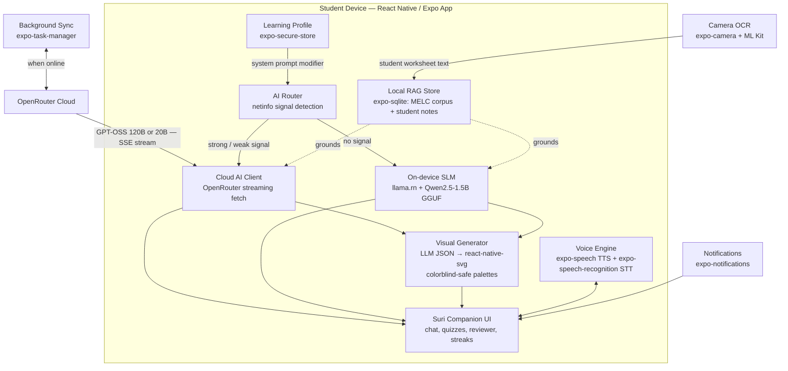

# Suri: Offline AI Study Companion for Filipino Learners
**Mobile App Edition — ACM TechSprint × Accenture**

> *"Matalinong kasama sa pag-aaral, kahit walang internet."*
> A study buddy that adapts to how you learn — offline or online, visual or auditory, standard or accessible.

---

## 1. Problem Statement

Filipino students face two compounding barriers that existing EdTech platforms haven't resolved together.

**Barrier 1 — Connectivity.** As of 2023, only about 28% of Philippine households had fixed home internet, and more than 35% of public schools have no internet connectivity at all (Borgen Project, 2025, citing PSA/DICT data). Meanwhile, field studies in rural provinces consistently find that almost all students already own a smartphone (Nueva Ecija digital-literacy study, 2025). The device gap is mostly closed. The connectivity gap is not.

**Barrier 2 — Inclusive support.** Republic Act 11650 (2022), the Inclusive Education Act, mandates that every Filipino learner with a disability receives quality education. The data shows the system cannot deliver on that mandate: only 391,089 learners with disabilities (LWDs) were enrolled in public schools in 2024–25 — just 8% of the estimated 5 million Filipino children with disabilities nationwide (EDCOM 2 / IDinsight, 2025). Of those enrolled, roughly 60% have no access to SPED programs, centers, or trained teachers at their school. In rural areas that number drops to one in four (Inquirer, 2025). Only 12.3% of teachers have SPED specialization (IJRISS, 2025), and classrooms of 40+ students with mixed needs and no aide are the norm.

Suri addresses both barriers together. Most EdTech platforms are built for students with consistent internet access and no learning differences. Suri is built for the student who has neither.

---

## 2. Why Mobile App, Not PWA

The original architecture explored a Progressive Web App. The switch to native mobile is a deliberate architectural decision, with each reason mapping to a real failure mode in the PWA approach:

| PWA failure mode | How mobile solves it |
|---|---|
| WebGPU crashes silently on budget Android Chrome | Native llama.cpp via `llama.rn` uses Android Vulkan/CPU directly — no browser dependency |
| IndexedDB can be silently evicted by Chrome's storage manager | `expo-sqlite` is persistent OS-controlled storage the browser cannot touch |
| Service workers fail opaquely on Android in low-memory conditions | `expo-task-manager` + `expo-background-fetch` are explicit and debuggable |
| Web camera API is inconsistent across budget Android browsers | `expo-camera` + ML Kit give hardware-accelerated, consistent OCR on any device |
| TTS/STT browser support varies dramatically across Android Chrome versions | `expo-speech` and `expo-speech-recognition` use native OS voice engines directly |
| PWA install prompt is buried and easy to miss | A real app icon on the home screen is the behavior students and schools already understand |
| PWA cache is cleared by Chrome storage cleanup | App storage is under the app's control, not the browser's discretion |

**APK-first distribution** is critical for the target demographic. Schools can share the APK over local Wi-Fi, Bluetooth, or USB drives. No Play Store data charges. No Google account required. No bandwidth barrier at install time.

---

## 3. Solution Overview

Suri is a React Native / Expo mobile app with a fox mascot/study companion that combines three core capabilities:

**Hybrid AI tutoring** — A 3-tier architecture routes requests to OpenRouter's free cloud model (GPT-OSS 120B) on good signal, a smaller faster cloud model on weak signal, and a quantized on-device SLM (via `llama.rn`) when completely offline. Students always have a tutor. Every response is grounded through a local RAG index of DepEd MELCs so answers stay curriculum-accurate.

**Adaptive learning modes** — A Learning Profile (set on first run, editable anytime) shapes every response the AI generates. Visual learners get diagrams by default. Auditory learners hear responses read aloud and can ask questions by voice. Students who prefer structured text get bullet-pointed explanations. Each profile is a system prompt modifier applied identically across all three signal tiers — same intelligence, different format.

**Built-in accessibility** — Dyslexia-friendly font, colorblind-safe diagram palettes, high-contrast mode, ADHD focus mode (shorter chunks, more micro-rewards), and low-vision support are all user-selectable settings, not afterthoughts. These address RA 11650's mandate for inclusive learning in schools that have no SPED teacher and no dedicated support tools.

---

## 4. Target Users & Scope

- **Primary:** Grades 4–10 students using DepEd's K-12 curriculum, with emphasis on rural/low-connectivity areas, students who study in Filipino or code-switch between Filipino and English, and learners with disabilities currently underserved in general education classrooms.
- **Secondary:** Teachers and parents (via optional sync dashboard) and senior high students reviewing for board-prep subjects.
- **Curriculum anchor:** DepEd Most Essential Learning Competencies (MELCs) — the streamlined 5,700-competency corpus — stored locally in `expo-sqlite` and used as the RAG grounding layer for all AI responses.

---

## 5. Core Features

### 5.1 Offline-First Mobile Architecture

- Distributed as an APK for sideloading and via Google Play Store.
- All core tutoring, quizzing, and reviewer features work with zero connectivity after the initial install and first-run curriculum download.
- `expo-task-manager` + `expo-background-fetch` handle silent background sync when a device comes back online — no manual update needed.
- `@react-native-community/netinfo` monitors signal type in real time and routes AI requests to the correct tier automatically.

### 5.2 Hybrid AI Engine (3-Tier Routing)

```
TIER 1 — Strong signal (4G / WiFi)
  → OpenRouter: openai/gpt-oss-120b:free
  → 117B MoE model, 5.1B active params per forward pass
  → SSE streaming: tokens appear immediately, even on slow 4G
  → Payload: top-3 MELC passages + question + learning profile modifier

TIER 2 — Weak signal (2G / 3G via netinfo effectiveType)
  → OpenRouter: openai/gpt-oss-20b:free (lower latency)
  → OR: serve cached SQLite RAG responses for common curriculum queries
  → Graceful mid-stream recovery: surfaces what was received + reconnecting state

TIER 3 — No signal
  → llama.rn: Qwen2.5-1.5B GGUF (~900MB, downloaded separately on first run)
  → Native llama.cpp bindings — Android Vulkan / CPU, no browser dependency
  → Same RAG grounding and learning profile modifier as Tier 1/2
  → Suri enters "Local" visual state (see Section 7)
```

The UI displays a subtle "Suri Cloud" / "Suri Local" indicator. Tier transitions are automatic and invisible to the student.

### 5.3 Local RAG Store ("Personalized Reviewer")

- `expo-sqlite` database holding pre-embedded MELC competency content, chunked by subject and grade level.
- MELC corpus embeddings are pre-computed at build time and bundled with the app — no runtime embedding model for base content.
- Students add their own materials: typed notes, or photos of worksheets processed via on-device OCR. Personal content is embedded at runtime using a compact embedding model and stored in a personal layer of the same SQLite database.
- Every AI response on every signal tier retrieves top-k relevant passages before generation — keeping answers curriculum-accurate and grade-level-appropriate.
- Cached cloud responses are stored in SQLite and served on subsequent offline requests for the same query, so frequently asked topics become progressively more "offline" over time.

### 5.4 Generative Visual Questions

- The AI outputs a structured JSON spec (chart type + data values, or diagram type + labeled components) which `react-native-svg` renders live within the chat.
- Every diagram is generated fresh for the specific question — not pulled from a fixed library.
- Visual specs pass through the RAG layer for fact-checking against MELC content before rendering.
- **Colorblind-safe by default:** the SVG renderer uses palette variants matched to the student's accessibility setting (standard / deuteranopia / protanopia / tritanopia) — every chart and diagram is usable by every student.
- Covers: bar/line charts, number lines, geometric figures, labeled science diagrams (cell parts, body systems, simple circuits), and basic maps.

### 5.5 Camera-Based Worksheet OCR

- Students photograph printed worksheets, textbook pages, or material written on a board.
- `expo-camera` captures; ML Kit Text Recognition (bundled, no network) extracts text on-device.
- Extracted text is embedded and added to the student's personal RAG layer — Suri can answer questions specifically about that worksheet.
- Works completely offline. No OCR API required.

### 5.6 Adaptive Learning Profiles

This is Suri's core differentiator. Every student learns differently. A Learning Profile shapes the format, depth, and modality of every AI response — across all three signal tiers — without requiring a different model or additional compute. It is a system prompt modifier, not a separate AI.

**Profile setup:** On first run, Suri presents a short 5-question interactive sequence showing the same concept in different formats and asking which felt clearest. The student can also skip to manual selection. Profile is editable anytime in Settings.

**Response format modes:**

| Mode | What changes in every AI response |
|---|---|
| **Visual** (default on if quiz indicates) | Suri defaults to a diagram spec for every concept. Text explanations reference the visual. Short paragraphs. |
| **Auditory** | Responses written to read naturally when spoken aloud. No bullet points. Full flowing sentences. TTS auto-plays on each response (see 5.7). |
| **Reading / Writing** | Structured text: bullet points, numbered steps, definitions first. Suitable for note-taking. |
| **Kinesthetic** | Responses are shorter; Suri invites the student to answer a drag-and-drop or tap-to-reveal question before explaining. |
| **Mixed** | Suri balances all modalities per topic complexity. Default for students who skip the quiz. |

**Accessibility comfort settings** (user-selectable, labeled by effect not by condition):

| Setting | What it does |
|---|---|
| **Reader Font** | Switches to OpenDyslexic across the entire app. Wider letter spacing. No italic text. |
| **Color Vision** | Applies deuteranopia / protanopia / tritanopia palette to all diagrams and UI accents. |
| **High Contrast** | Full white/black UI, increased border weight on all elements. |
| **Large Text** | Scales all text 1.3×. SVG diagram labels scale to match. |
| **Focus Mode** | Responses capped at ~120 words. Broken into one idea per message. More frequent micro-celebration moments between responses. Designed for attention regulation. |
| **Low Motion** | Disables all non-essential animation. Suri's idle animation becomes a static image. |

> **Design note:** None of these settings are labeled as "disability modes" or require the student to self-identify with any condition. They are framed as "how Suri talks to you" — purely user choice.

**Technical implementation:**
```typescript
interface LearningProfile {
  responseMode: 'visual' | 'auditory' | 'reading' | 'kinesthetic' | 'mixed';
  accessibilitySettings: {
    readerFont: boolean;
    colorVision: 'standard' | 'deuteranopia' | 'protanopia' | 'tritanopia';
    highContrast: boolean;
    largeText: boolean;
    focusMode: boolean;
    lowMotion: boolean;
  };
  gradeLevel: number;
}

// Applied to EVERY AI call across all 3 tiers — same function, same prompt modifier
function buildSystemPrompt(profile: LearningProfile, ragChunks: string[]): string
```

### 5.7 Voice Mode (TTS + STT)

- **Text-to-Speech:** `expo-speech` reads every Suri response aloud. Works offline on iOS (native OS TTS engine). On Android, depends on the device's installed TTS engine (Google TTS, bundled on most devices from Android 5+). Auditory mode auto-enables TTS. A "Listen" button appears on every response in all modes.
- **Speech-to-Text:** Students can tap a mic button and speak their question instead of typing. Powered by `expo-speech-recognition` (SDK 54, uses native OS recognition). Supports Filipino and English. On Android, STT may require a brief network call on some devices — this is surfaced to the student transparently ("Speaking requires a moment of signal").
- **Impact:** Makes Suri accessible to students with reading difficulties, lower literacy levels, and anyone who finds typing on a small screen slower than speaking.

### 5.8 Study Buddy Mode (Suri Mascot)

- Fox-voiced conversational tutor defaulting to Socratic guidance (leading question first, answer second) — pedagogically stronger and preempts "this does homework for me" concerns.
- Adjustable tone and difficulty by grade level from the student's Learning Profile.
- Animated via `react-native-reanimated v3`:
  - **Idle:** slow gentle bounce
  - **Thinking:** ears perk, tail sweeps (plays during AI inference)
  - **Celebrating:** energetic bounce, tail wag (correct answers, streak milestones)
  - **Listening:** animated sound wave ring around Suri's face (STT active)
  - **Low Motion mode:** all above animations replaced by Suri's static "calm" illustration

### 5.9 Gamification & Streak System

- Study streaks tracked locally in `expo-sqlite`. No backend required.
- Suri evolves visually as streaks build: kit fox → young fox → elder fox with subtle glowing markings.
- `expo-notifications` sends local (no server) streak reminder notifications at the student's preferred study time.
- Badges for subject completions, streak milestones, voice sessions, and first camera-capture session.
- Focus Mode (accessibility setting) increases the frequency of mid-session micro-rewards to sustain engagement.

---

## 6. Stretch Features (Phase 2, Post-Hackathon Roadmap)

Ordered by implementation priority:

| Feature | Why it matters | Priority |
|---|---|---|
| **Code-switching support** (Filipino/English/Tagalog code-mix) | Matches how students actually speak. The cloud model handles some code-switching already — this formalizes it via prompt engineering and dialect detection. | High |
| **Spaced-repetition scheduling** | Turns the reviewer into a long-term retention tool. `expo-sqlite` already tracks all answered questions — the algorithm is the remaining work. | High |
| **Parent/teacher dashboard** (sync-when-online) | Progress visibility without requiring the student to be always online. Requires a Supabase backend. | Medium |
| **Lite Mode** (for older/budget devices) | Smaller SLM model (Qwen2.5-0.5B), reduced animation complexity, lower RAM footprint. Keeps the offline promise honest at the true low end. | Medium |
| **Classroom mesh sync** (WebRTC / BLE device-to-device) | One connected phone passes a curriculum pack to a whole classroom. Technically complex — `react-native-webrtc` or `react-native-ble-plx`. | Later |
| **Fine-tuned Filipino model** | Replace cloud model with a SEA-LION fine-tune for stronger Tagalog handling. Requires training budget. | Later |

---

## 7. Mascot & Brand Identity

**Name: Suri** — from *suriin* ("to examine/analyze"). A natural Filipino nickname that reads as companion rather than tech-brand.

**Personality:** Quick-witted, encouraging, never condescending. Asks before telling. Changes *how* it explains depending on your profile — not what it knows, but how it shares it.

**Visual design:**
- Chibi proportions: large head/eyes, small body. Approachable and lightweight as a vector asset.
- Philippine accent: a small sun-ray tuft on the chest (echoing the flag's sun) or a woven *salakot*-style accessory instead of a generic graduation mortarboard.
- Warm orange/cream base with a single accent color reserved for "AI thinking" states: a soft glow on the tail tip during inference.

**Signal-tier states:**
- **Suri Cloud** (Tier 1/2): Full color, tail glowing, full-energy animations.
- **Suri Local** (Tier 3 / offline): Slightly desaturated palette, a small *buwan* (moon) icon above Suri's head, reduced animation complexity. Visual indication of offline mode without text labels.

**Learning mode states:**
- **Auditory mode**: A soft animated audio-wave ring appears around Suri when TTS is active.
- **Focus mode**: Suri's expression shifts to calm/focused. Fewer visual elements in the chat viewport.
- **Low Motion mode**: Suri is a high-quality static illustration across all states.

**Evolution mechanic:** Streaks trigger visual evolution (kit → young fox → elder fox with glowing markings) — in the spirit of, but visually distinct from, Duolingo.

---

## 8. Technical Architecture



**Full Stack:**

| Layer | Technology | Notes |
|---|---|---|
| Framework | React Native + Expo SDK 54 | Managed workflow |
| Distribution | APK sideload + Play Store | APK-first for school Wi-Fi sharing |
| Tier 1 AI | OpenRouter → `openai/gpt-oss-120b:free` | 117B MoE, 5.1B active params, SSE streaming |
| Tier 2 AI | OpenRouter → `openai/gpt-oss-20b:free` | Lower latency on weak signal |
| Tier 3 AI | `llama.rn` + Qwen2.5-1.5B GGUF | Native llama.cpp, Android Vulkan / CPU |
| Local database | `expo-sqlite` | MELC corpus, sessions, streaks, cached responses |
| Vector store | `expo-sqlite` + cosine similarity | Pre-computed MELC embeddings + runtime personal content |
| Learning Profile | `expo-secure-store` | Profile, grade level, accessibility settings |
| Visual rendering | `react-native-svg` | JSON spec → charts and diagrams; colorblind palette variants |
| Camera OCR | `expo-camera` + ML Kit Text Recognition | On-device, offline, worksheet photo capture |
| TTS | `expo-speech` | Works offline on iOS; Android depends on device TTS engine |
| STT | `expo-speech-recognition` | Native OS recognition; Filipino + English; may need brief signal on Android |
| Accessibility font | `expo-font` + OpenDyslexic | Free, open-source, bundled at build time |
| Signal detection | `@react-native-community/netinfo` | `effectiveType` for tier routing |
| Background sync | `expo-task-manager` + `expo-background-fetch` | Silent curriculum updates when online |
| Notifications | `expo-notifications` | Local streak reminders, no server required |
| Animations | `react-native-reanimated v3` | Suri state machine; respects lowMotion profile setting |
| Kinesthetic interactions | `react-native-gesture-handler` | Drag-and-drop quizzes in kinesthetic mode |

---

## 9. Why This Is Differentiated

| | Typical "AI study app" | Suri |
|---|---|---|
| Offline mode | Caches pre-made content at best | Full AI tutoring on-device via native llama.cpp — not just static content |
| Visuals | None, or a fixed pick-from-library | Generated fresh per question, grounded in MELC content, colorblind-safe by default |
| Language | English-first, Filipino bolted on via translation | Routes to multilingual cloud model; offline model selected for Filipino/Tagalog capability |
| Personalization | Same response format for every student | Learning Profile adapts response mode, modality, and depth per student; system prompt modifier costs zero extra compute |
| Accessibility | Not designed for LWDs | Multiple comfort settings built-in (Reader Font, Color Vision, High Contrast, Focus Mode, Low Motion); addresses RA 11650 mandate |
| Voice | Not supported | TTS + STT built in; Auditory mode reads all responses aloud; students can speak questions |
| Distribution | Requires internet to install | Shareable as APK over local Wi-Fi, USB, or Bluetooth — no app store, no data charges at install |
| Data | Cloud API by default | Inference on-device by default — privacy by architecture, not policy |

---

## 10. Risks & Honest Mitigations

**On-device SLM (Tier 3) is weaker than the cloud model.**
Mitigated by RAG grounding — retrieval does much of the accuracy work that raw model size would otherwise need to do. The cloud model handles quality; the SLM handles resilience. Students are informed which mode they are in.

**OpenRouter free tier limits (20 req/min, ~200 req/day).**
Mitigated by the SQLite response cache (repeat curriculum questions hit cache, not the API) and the Tier 3 SLM (absorbs traffic when the free quota is exhausted). Production path: self-hosted inference or paid OpenRouter credits — both are one-line config changes, not architectural changes.

**llama.rn model download (~900MB) could be a barrier on limited storage.**
Mitigated by separating the model download from the app install. The app (~50MB APK) installs first and works immediately on Tier 1/2. The model download is a separate one-time prompt ("Download Suri Local for offline use") with a progress screen designed to complete over school Wi-Fi.

**GPT-OSS 120B was trained primarily on English.**
Mitigated by testing Filipino/Tagalog quality before launch and having DeepSeek V3 (also free on OpenRouter, stronger multilingual) as a drop-in alternative. The cloud model is one config line, not an architectural commitment.

**"Learning styles" (VARK) is disputed in educational research.**
Acknowledged and addressed in how Suri frames its profiles. Suri does not claim to match instruction to a fixed "learning style." It offers multiple representations of the same content (visual, auditory, text) and lets the student choose their preferred default. Multimodal learning — offering multiple representations — is evidence-backed even if fixed learning style matching is not. The framing in the app is "how Suri talks to you," not "your learning style."

**STT on Android may require brief connectivity.**
Surfaced to the student transparently. On devices with Google TTS/STT engines (the majority of Android 5+ devices), this is generally handled on-device or with a very short network call. Low-connectivity students can use text input as fallback — STT is additive, not required.

**Accessibility settings need user research to implement well.**
Acknowledged. The hackathon MVP implements the settings technically; the visual/UX design for each mode should be reviewed with representative users (students with dyslexia, color vision differences, attention regulation needs) before wide release. The spec intentionally avoids diagnosing or labeling — settings are purely user choice.

---

## 11. MVP Scope for the Hackathon

All of the following can be demoed on a physical Android device with no special hardware:

1. **App shell** — React Native/Expo app with offline detection, bottom-tab navigation (Chat, Reviewer, Quizzes, Profile).
2. **Cloud AI streaming** — OpenRouter GPT-OSS 120B with SSE streaming. Tokens appear in real time. Shows Suri is conversational and responsive.
3. **Learning Profile setup** — First-run quiz or direct selector. Visual / Auditory / Reading / Mixed. Demonstrates personalization immediately.
4. **Adaptive response demo** — Same question asked in Visual mode and Auditory mode side-by-side in the pitch. Visual mode returns a diagram. Auditory mode returns clean prose + auto-plays TTS. Judges see the system prompt modifier working live.
5. **Working RAG** — Pre-loaded Grade 6 Science MELCs in SQLite. Ask a question. Show the grounded, grade-level-accurate answer with source passage cited.
6. **2–3 visual types** — Bar chart + labeled science diagram (e.g., plant cell) from LLM JSON spec via react-native-svg.
7. **Accessibility demo** — Toggle Reader Font (OpenDyslexic) and High Contrast live on stage. Two taps, instant effect. Simple but visible.
8. **TTS** — "Listen" button on any Suri response reads it aloud. Low-effort, high-impact demo of the auditory mode.
9. **Offline fallback** — Kill the network. Show SQLite cached responses returning instantly. Describe llama.rn SLM as committed next-sprint work with model and library already chosen.
10. **Suri mascot** — Idle and Thinking animated states in chat UI.

**Not required for hackathon:**
- llama.rn full SLM integration (roadmap, with model selected)
- STT (stretch for demo if time permits)
- Camera OCR (high-value stretch if working)
- Kinesthetic mode interaction polish
- Spaced repetition, parent dashboard, mesh sync (all in pitch deck "what's next")

---

## 12. One-Line Pitch

*"Suri is the only study companion that adapts to how you learn — visual, auditory, or accessible — working entirely offline on a Filipino student's phone, thinking in Filipino, and drawing a new diagram for every question instead of picking one off a shelf."*

---

*Sources: Borgen Project (2025); DICT NICTHS (2019) via DepEd (2021); Nueva Ecija rural digital-literacy study (2025); EDCOM 2 / IDinsight Policy Brief "Accelerating Support for Learners with Disabilities" (November 2025); Inquirer Opinion "Fixing the gaps in inclusive education" (May 2025); IJRISS "Barriers and Enablers of Inclusive Education for Learners with Disabilities in Philippine Primary Schools" (2025); Republic Act 11650 "Inclusive Education Act" (2022); ExploreLearning/Gizmos product documentation; OpenAI GPT-OSS model card (2025); OpenRouter free model tier documentation (2025); llama.rn documentation; DepEd MELC guidance materials.*
